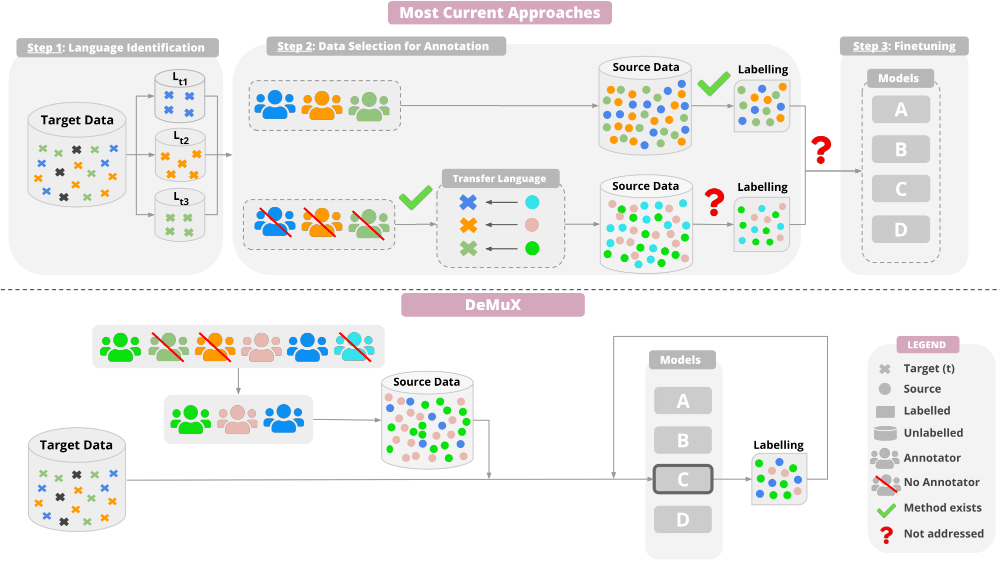

# DeMuX: Data-efficient Multilingual Learning
[](https://arxiv.org/abs/2305.14716)

Code for DeMuX: Active-learning based data-selection strategies for efficient annotation of multilingual data.
<p align="center">

</p>

## Table of Contents
1. [Environment](#environment)
2. [Reproducing Paper Results](#reproducing-paper-results)
   - [Step 1: Fine-tune multilingual models on English data](#step-1-fine-tune-multilingual-models-on-english-data)
   - [Step 2: Fine-tune multilingual models on source languages using active learning](#step-2-fine-tune-multilingual-models-on-source-languages-using-active-learning)
    - [Step 3: Collect and visualize results](#step-3-collect-and-visualize-results)
3. [Baselines](#baselines)
4. [Running for multiple budgets](#running-for-multiple-budgets)
5. [Notes on experimentation based on our observations](#notes-on-experimentation-based-on-our-observations)
6. [Running with custom models and datasets](#running-with-custom-models-and-datasets)
7. [Additional Support/Issues?](#additional-supportissues)
8. [Citation](#citation)

## Environment
We use [Miniconda](https://docs.conda.io/en/latest/miniconda.html) to manage the environment. Our Python version is 3.10.11. To create the environment, run the following command:

```
conda env create -f environment.yml -n demux-env
```

To activate the environment, run the following command:

```
conda activate demux-env
```

## Reproducing Paper Results
## Step 1: Fine-tune multilingual models on English data
We currently support the following datasets: 
- Token-level:
  - `udpos`: Universal Dependencies v2.5 
  - `PAN-X` : WikiAnn
- Sequence-level:
  - `xnli`: XNLI
- Question Answering:
  - `tydiqa`: TyDiQA-GoldP
- Machine Translation (skip this step for MT):
  - `opus`: OPUS-100
  - `nllb`: NLLB 
  - `flores200`: Flores-200

The models supported in the scripts are `xlm-roberta-large`, `infoxlm-large` and `rembert`. First, we fine-tune multilingual models on labelled data in English for the task. To do this, run the following command:

```
bash scripts/train/run_ft_en.sh [MODEL] [DATASET]
```

For example, to fine-tune `xlm-roberta-large` on `udpos`, run the following command:

```
bash scripts/train/run_ft_en.sh xlm-roberta-large udpos
```

One can also fine-tune the model on other languages if desired, by specifying the language code in the `run_ft_en.sh` script.

Note, for TyDiQA we first fine-tune the model on SQuAD v2, given the small size of TyDiQA. Clone the HF `transformers` repo in your home directory. To ensure that you're working with the same version of the codebase, you can checkout to this commit: 
```
git checkout dadc9fb4275f4b7c2984d16d6d9a7880ec76d872
```

You will also need to change the environment since the transformers version required to run this is different. The minimum transformers version required is `4.31.0.dev0`. The rest of the requirements can be found [here](https://github.com/huggingface/transformers/blob/main/examples/pytorch/question-answering/requirements.txt). Once the dependencies are installed, you can fine-tune a model as follows:
```
bash scripts/train/run_ft_squad_v2.sh [MODEL]
```


## Step 2: Fine-tune multilingual models on source languages using active learning
We describe five source and target language configurations in our paper: `target_hp`, `target_mp`, `target_lp`, `target_geo` and `target_lp-pool`. Additionally, we have six supported strategies: `random`, `egalitarian`, `average_dist`, `knn_uncertainty`, `uncertainty` and `gold`. Please refer to the paper on details of the configurations and strategies. To fine-tune the above models for a configuration and strategy, run the following command:

```
bash scripts/train/run_ft_al.sh [FT-MODEL_PATH] [DATASET] [CONFIG] [STRATEGY]
```
Note that the configs for all datasets are given in `scripts/train/dataset-configs.yaml`. This file can be updated with custom dataset details.

To fine-tune a model on all strategies, we have wandb sweep configs defined in `scripts/train/wandb/configs`. These configs can be created by running the following command: 
```
bash scripts/train/wandb/create_configs.sh
```
To create a sweep job for each config run the following command:

```
bash scripts/train/wandb/create_config_jobs.sh
```
This will create a sweep job for each config in `scripts/train/wandb/jobs`.

We also support multi-GPU training, using HF `accelerate`. A sample script can be found here: `scripts/train/sample_multi-gpu.sh`.

Support for MT was added post other supported tasks. Please find sample run scripts for MT under `scripts/train/wandb/jobs/mt`.


## Step 3: Collect and visualize results
To collect results across strategies run so far, run the following command. This will aggregate results over all strategies for the specified configuration. This script also collects the deltas in performance between the strategies for all configs.

```
bash scripts/evaluation/run_collect_results_all.sh
```
To collect results for a specific model and target configuration, run the following command. This will aggregate results over all strategies for the specified configuration.

```
bash scripts/evaluation/run_collect_results_single_model.sh [MODEL_PATH]
```

To visualize the embeddings of the unlabelled source data, target data and the selected data, for all the models and cofigs, run the following command. By default, this will generate a plot for the data selected from the last round, which includes data selected in all previous rounds. However, this can be controlled by setting the `al_round_to_show` variable in the script.

```
bash scripts/evaluation/run_visualize_embeddings_all.sh
```

To visualize the embeddings of the unlabelled source data, target data and the selected data, for a specific model and config, run the following command.

```
bash scripts/evaluation/run_visualize_embeddings_single_model.sh [EMBEDDING_PATH]
```

## (Optional) 
- Find uncertainty and loss correlations between target point and neighborhood:
  - ``` bash scripts/train/run_find_correlation.sh ```
- Get lang2vec distances between all language pairs for a given dataset
  - ``` bash scripts/helper/l2v/run_l2v_distances.sh ```

## Baselines
- `RANDOM` and `EGALITARIAN` are already included in our fine-tuning scripts above.
- `LITMUS`: Run the following bash scripts to get augmentation suggestions for the configs in our paper
  - `udpos`: ```bash scripts/baselines/litmus/run_litmus_udpos.sh```
  - `PAN-X`: ```bash scripts/baselines/litmus/run_litmus_PAN-X.sh```
  - `xnli`: ```bash scripts/baselines/litmus/run_litmus_xnli.sh```
  - `tydiqa`: ```bash scripts/baselines/litmus/run_litmus_tydiqa.sh```

## Running for multiple budgets
We evaluate the applicability of demux for data selection under very limited budgets, and without multiple rounds of fine-tuning. We find our strategies to be most effective (over random selection), under low budget scenarios (<100 samples), with diminishing returns as the budget increases. To run experiments for multiple budgets and across all strategies, modify the following:

```
bash scripts/train/run_mul-bud_all.sh 
```

## Notes on experimentation based on our observations

- The larger the source dataset, the better the performance (in general). This is because the strategies have a lot of data to choose from, making a random selection sub-optimal.

- With increasing budgets come diminishing returns. Since we are dealing with fine-tuned models, we observe we don't need multiple rounds of fine-tuning (1-2 rounds suffice).

- For distance based strategies, the data selected is a reflection of the quantity and quality of your unlabelled target dataset. With better unlabelled target data, the efficacy of the strategies improves.

- Token-level, sequence-level and MT tasks benefit from distance-based strategies. For QA, our uncertainty strategy works best, but there is potential to improve our KNN-UNCERTAINTY strategy such that we can give more importance to uncertainty.

- With competent model representations come better estimates of distance and uncertainty, and hence more effective data selection. 

- If the source data contains multiple languages that are similar to your target in different ways (syntactic, phonological, geograhic distance, language family etc.), the strategies will be more effective across a variety of tasks and datasets.


## Running with custom models and datasets
With regards to models, the scripts should work with any model supported by HuggingFace. Simply specify the model identifier in the scripts. The variables one would need to specify/change according to the model they fine-tune are as follows: `LR` (learning rate), `epochs`, `max_seq_length`. This can be easily done in `run_ft_en.sh`. 

With regards to datasets, the scripts should work with any dataset supported by HuggingFace OR custom dataset files (saved in arrow format). If using an HF dataset, one must specify the following: `source_languages`, `target_languages` and `dataset`. If using custom dataset files, one must specify: `source_dataset_path` and `target_dataset_path`. The `source_dataset_path` and `target_dataset_path` must be directories contining the following files:
```
source_dataset_path: 
  - train
  - validation
target_dataset_path: 
  - target
  - test
```
In the above, `train` and `validation` contain the train and test splits for the source data, `target` is the unlabelled target data, and `test` is the test data we want to eventually improve performance for. Each directory can have the following files: `data-*of*.arrow`, `dataset_info.json` and `state.json`. A sample script to convert a CSV file to this format is given in `convert_csv_to_arrow.py`. Please include a language column. If the language is unkown, add "unknown" as the language column value. This is needed to calculate selected data statistics.

One can even specify a custom dataset for source/target and use an HF dataset for the other. Note that if a custom dataset is provided, it will always override HF for the source or target. 

All dataset configs can be found in `scripts/train/dataset-configs.yaml`. Make sure to add your custom dataset config to this file. If `remove_columns` is not specified, the script removes all columns, except those obtained after tokenization and pre-processing (example, `input_ids`, `attention_mask` and `labels`). 

To fine-tune a model on a custom dataset, run the following command:

```
bash scripts/train/run_ft_en.sh [MODEL] [DATASET_NAME] [SOURCE_LANGUAGES] [TARGET_LANGUAGES] [MODEL_PATH][SOURCE_DATASET_PATH] [TARGET_DATASET_PATH]
```

Note that many of the above variables are optional. For example, if you want to fine-tune a model on a custom dataset, with default source and target languages, and no custom model path, you can run the following command:

```
bash scripts/train/run_ft_en.sh xlm-roberta-large custom "" "" "" <path_to_source_data> <path_to_target_data>
```

The scripts under `scripts/train/wandb/jobs/mt` for example, use a custom dataset as the target and a HF dataset as the source. 


## Additional Support/Issues?
If you want us to support more tasks, models, datasets; or have suggestions on better ways to measure distance and uncertainty for any task, please let us know by opening an issue or sending us an email at <skhanuja@andrew.cmu.edu>. We are happy to discuss and add support for your use case! 


## Citation

If you find this work or our code useful, please consider citing:

```
@article{khanuja2023demux,
  title={DeMuX: Data-efficient Multilingual Learning},
  author={Khanuja, Simran and Gowriraj, Srinivas and Dery, Lucio and Neubig, Graham},
  journal={arXiv},
  year={2023}
}
```


